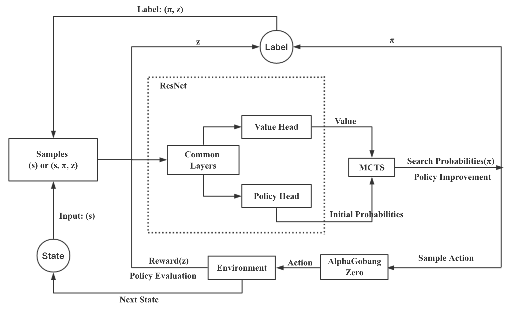
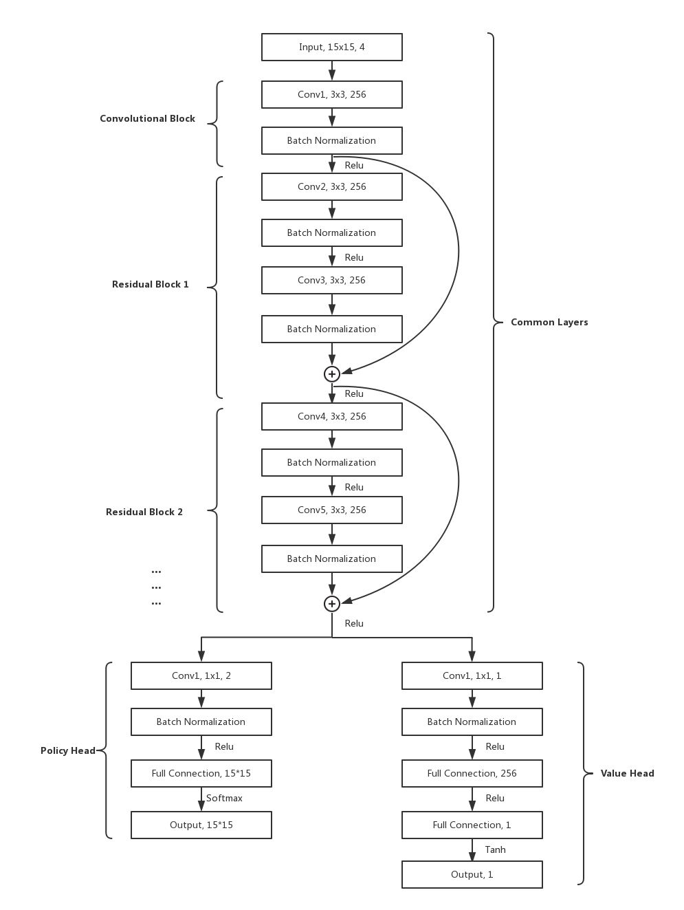
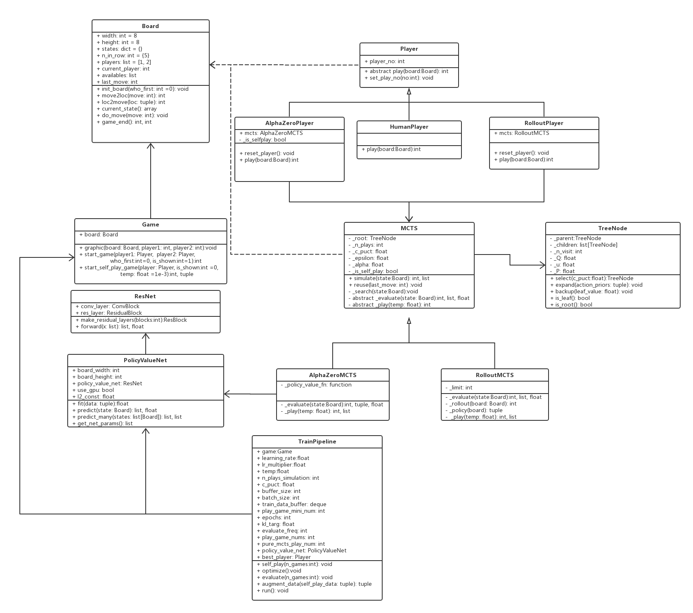
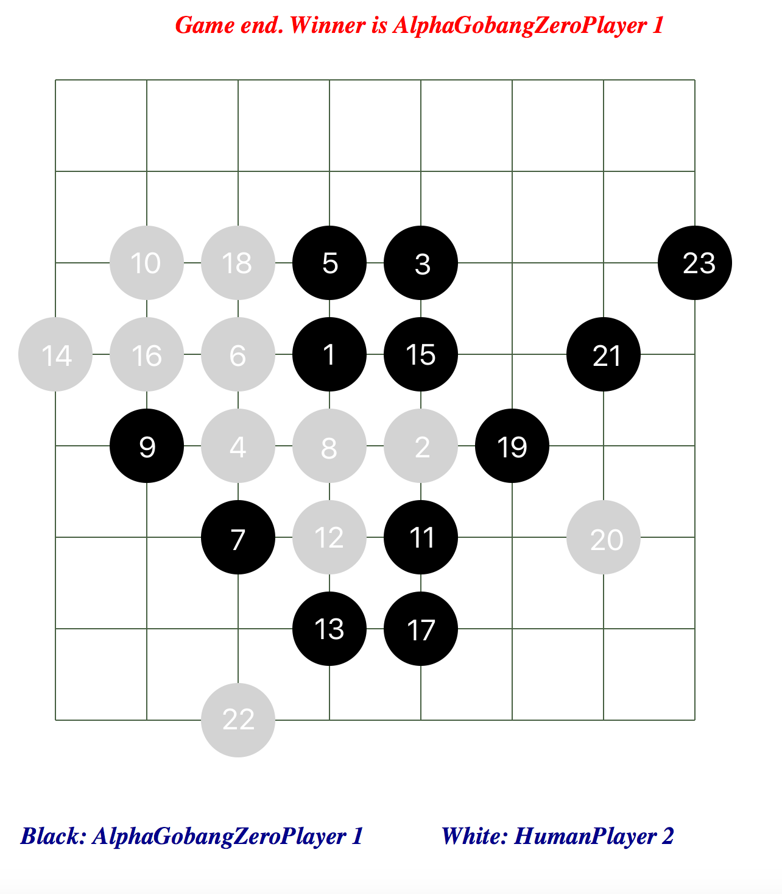

## Overview
This is a AlphaZero Implementation of Gobang based on Pytorch.

## Pytorch 0.3.1 Install
https://ptorch.com/news/145.html

## Github
Code can be viewed in my github：https://github.com/xuetf/AlphaZero_Gobang


## Design

### RL framework


### Network Structure


### Class Diagram


Illustration can be viewed in my blog: http://xtf615.com/2018/02/24/AlphaZeroDesign/

## Final Homework Report(CVPR format)


## Code
- Train.py : Run the train process
- Run.py : Play with Human using the trained model
- Player.py: Base class for different Player
- RolloutPlayer.py: Player with MCTS using random rollout policy
- AlphaZeroPlayer.py: AlphaZero Player with MCTS guided by Residual Network
- HumanPlayer.py: Human Player
- MCTS.py: Base class for different MCTS
- AlphaZeroMCTS.py: MCTS guided by Residual Network
- RolloutMCTS.py: MCTS using random rollout policy
- TreeNode.py: MCTS Tree Node
- PolicyValueNet.py: Redisual Network Implementation based on Pytorch
- Board.py: Board Class for Gobang
- Game.py: Game for Gobang
- VisualTool.py: Tk Tool for visualizing Chess Board
- Config.py: store config. Serve as a snapshot when resuming


## Running Code
### Training
-  Train from scratch: 

```python3 Train.py```

- Train as a background job,then:

```nohup python3 -u Train.py > train.log 2>&1 &```

- Train from a checkpoint:

```python3 Train.py --config data/model_name.pkl ```

### Play game

```python3 Run.py```

## Result



## Download or Upload From your OWN remote server

### Download the trained model from remote server
scp root@ip:/usr/local/workspace/AlphaZero_Gobang/data/current_policy_resnet_epochs_1500.model /Users/xuetf/Downloads

### Upload -P  
scp -P 8381 local_file_path root@139.199.21.83:/root/

